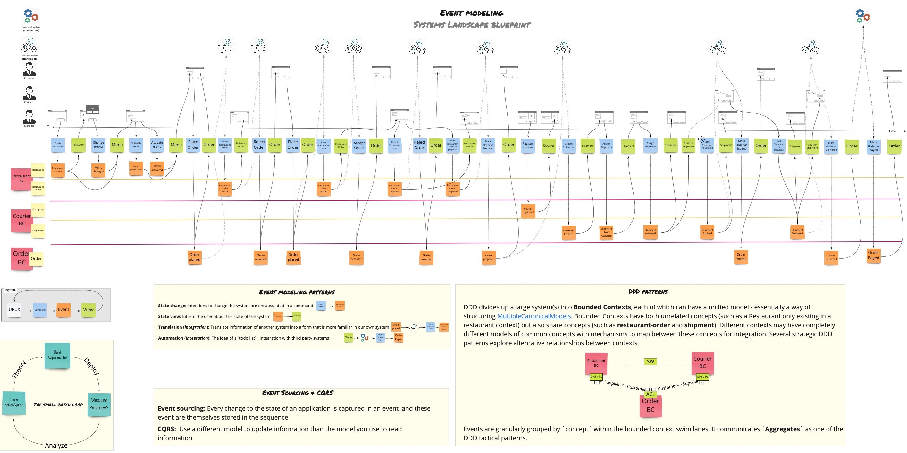
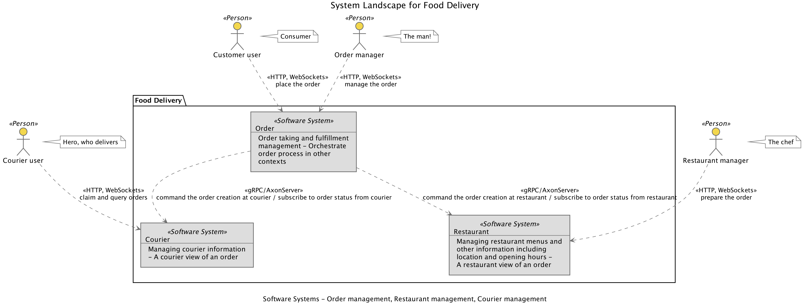
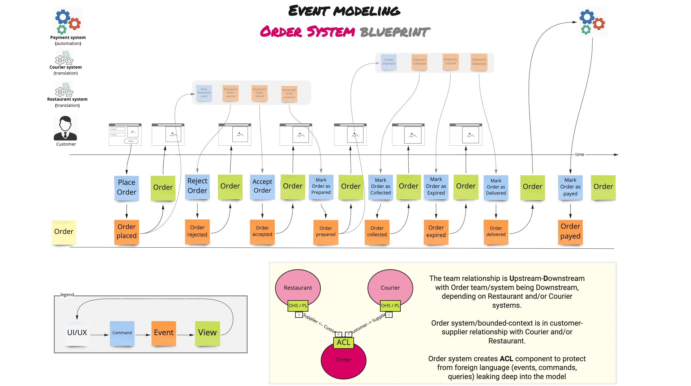
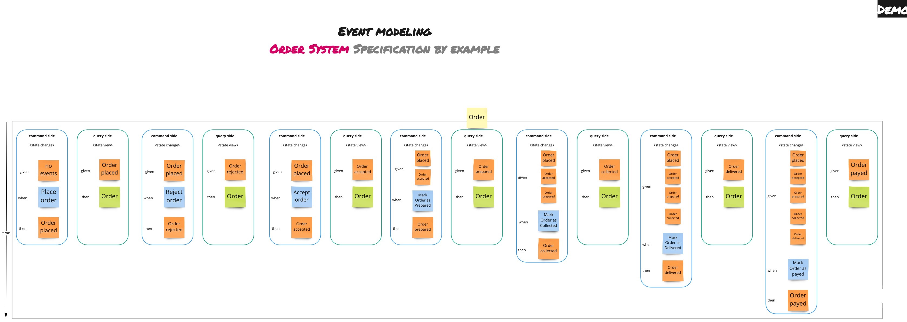
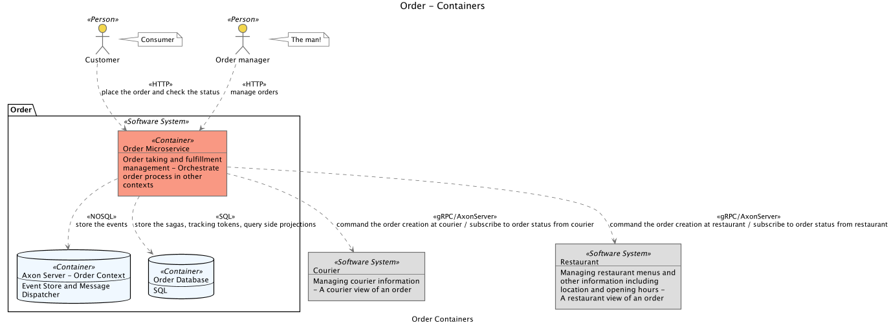
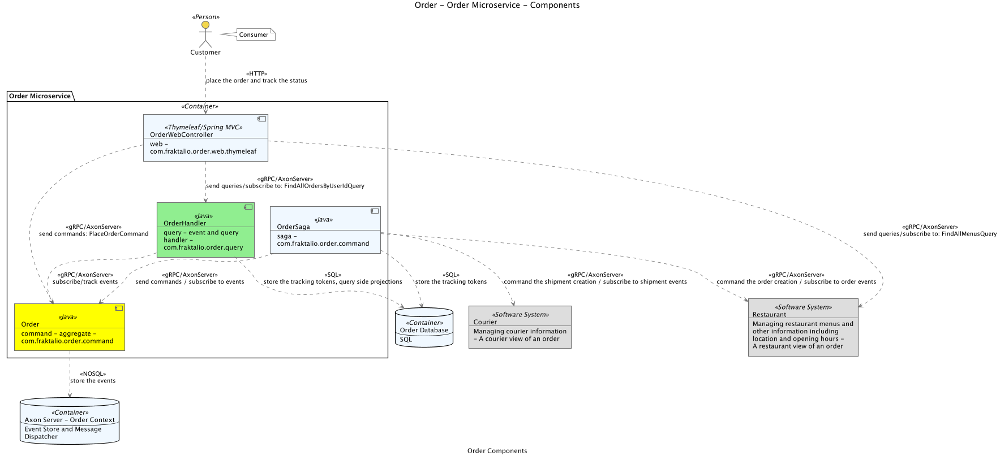

# Order - demo


## Systems Landscape
The systems landscape consists of three systems [order management](https://github.com/fraktalio/order-demo), [restaurant management](https://github.com/fraktalio/restaurant-demo) and [courier management](https://github.com/fraktalio/courier-demo)

Customers use the web application to place food orders at local restaurants. Application(s) coordinates a restaurant/kitchen order preparation, and a network of couriers who deliver the orders.

### Vision
[Event Modeling](https://eventmodeling.org/) is a method of describing systems using an example of how information has changed within them over time.



### Structure
The [C4 software architecture model](https://c4model.com/) is a simple hierarchical way to think about the static structures of a software system in terms of containers, components and classes (or code).

A System `Context` diagram can be a useful starting point for diagramming and documenting a software system, allowing you to step back and look at the big picture.



## **Order Management System**

Order taking and fulfillment management system. Orchestrates order management at the Restaurant and Courier systems.

### Vision
We zoom in to show the event model of the Order Management System only:



Specification by example (SBE) is a collaborative approach to defining requirements and business-oriented functional tests for software products based on capturing and illustrating requirements using realistic examples instead of abstract statements.



### Structure
Once you understand how your system fits in to the overall IT environment with a System Context diagram, a really useful next step can be to illustrate the high-level technology choices with a Container diagram:



Following on from a Container diagram showing the high-level technology decisions, you can then start to zoom in and decompose each container further:



### Canvas

<table>
    <tr>
        <td><strong>Name:</strong></td>
        <td colspan="3">Order Management</td>
    </tr>
    <tr>
        <td><strong>Description:</strong></td>
        <td colspan="3">Order taking and fulfillment management system</td>
    </tr>
    <tr>
        <td><strong>Concepts:</strong></td>
        <td><strong>Architectural patterns:</strong></td>
        <td><strong>Technology:</strong></td>
    </tr>
    <tr>
        <td>
            <ul>
                <li>Domain Driven Design</li>
            </ul>
        </td>
        <td>
            <ul>
                <li>Event Driven Microservices</li>
                <li>Eventsourcing</li>
                <li>CQRS</li>
            </ul>
        </td>
        <td>
            <ul>
                <li>Java</li>
                <li>Axon</li>
                <li>Spring(Boot)</li>
                <li>SQL(Postgres)</li>
                <li>Docker</li>
                <li>Testcontainers</li>
                <li>Kubernetes</li>
                <li>Prometheus</li>
                <li>Grafana</li>
                <li>Jaeger</li>
            </ul>
        </td>
    </tr>
    <tr>
        <td colspan="3"><strong>Service API</strong></td>
    </tr>
     <tr>
        <td>Commands:</td>
        <td>Queries:</td>
        <td>Events published:</td>
    </tr>
    <tr>
        <td>
            <i>gRPC:</i>
            <ul>
                <li>PlaceOrderCommand</li>
                <li>RejectOrderCommand</li>
                <li>AcceptOrderCommand</li>
                <li>MarkOrderAsPreparedCommand</li>
                <li>MarkOrderAsCollectedCommand</li>
                <li>MarkOrderAsExpiredCommand</li>
                <li>MarkOrderAsDeliveredCommand</li>
                <li>MarkOrderAsPayedCommand</li>
            </ul>
        </td>
        <td>
            <i>gRPC:</i>
            <ul>
                <li>FindOrderQuery</li>
                <li>FindAllOrdersQuery</li>
            </ul>
        </td>
        <td>
            <i>gRPC:</i>
            <ul>
                <li>OrderPlaced</li>
                <li>OrderRejected</li>
                <li>OrderAccepted</li>
                <li>OrderPrepared</li>
                <li>OrderCollected</li>
                <li>OrderExpired</li>
                <li>OrderDelivered</li>
                <li>OrderPayed</li>
            </ul>
        </td>
    </tr>
    <tr>
        <td colspan="3"><strong>Domain model:</strong></td>
    </tr>
    <tr>
        <td colspan="3">
            <ul>
                <li>Order</li>
            </ul>
        </td>
    </tr>
    <tr>
        <td colspan="3"><strong>Dependencies:</strong></td>
    </tr>
    <tr>
        <td colspan="1">Invokes</td>
        <td colspan="2">Subscribes to</td>
    </tr>
    <tr>
        <td colspan="1">
            <ul>
                <li>FindAllMenusQuery (<a href="https://github.com/fraktalio/restaurant-demo" target="_blank">Restaurant system</a>)</li>
                <li>PlaceRestaurantOrderCommand (<a href="https://github.com/fraktalio/restaurant-demo" target="_blank">Restaurant system</a>)</li>
                <li>CreateShipmentCommand (<a href="https://github.com/fraktalio/courier-demo" target="_blank">Courier system</a>)</li>
            </ul>
        </td>
        <td colspan="2">
            <ul>
               <li>RestaurantOrderRejectedEvent (<a href="https://github.com/fraktalio/restaurant-demo" target="_blank">Restaurant system</a>)</li>
               <li>RestaurantOrderPlacedEvent (<a href="https://github.com/fraktalio/restaurant-demo" target="_blank">Restaurant system</a>)</li>
               <li>RestaurantOrderPreparedEvent (<a href="https://github.com/fraktalio/restaurant-demo" target="_blank">Restaurant system</a>)</li>
               <li>ShipmentCollectedEvent (<a href="https://github.com/fraktalio/courier-demo" target="_blank">Courier system</a>)</li>
               <li>ShipmentExpiredEvent (<a href="https://github.com/fraktalio/courier-demo" target="_blank">Courier system</a>)</li>
               <li>ShipmentDeliveredEvent (<a href="https://github.com/fraktalio/courier-demo" target="_blank">Courier system</a>)</li>
           </ul>
        </td>
    </tr>
</table>


## Development

This project is driven using [maven].


### Run locally 

**Requirements**

- [Java 11+](https://adoptopenjdk.net/)


>You can [download](https://download.axoniq.io/axonserver/AxonServer.zip) a ZIP file with AxonServer as a standalone JAR. This will also give you the AxonServer CLI and information on how to run and configure the server.
>
>Alternatively, you can run the following command to start AxonServer in a Docker container:
>
>```
>docker run -d --name axonserver -p 8024:8024 -p 8124:8124 axoniq/axonserver
>```

**Build & Test**

```bash
./mvnw clean verify
```

**Run**

```bash
./mvnw spring-boot:run
```

### Run on Kubernetes cluster

**Requirements**

>- [Kubernetes](https://kubernetes.io/). It is included in the Docker on Mac (and Windows) binary so it installed automatically with it. After a successful installation, you need to explicitly enable Kubernetes support. Click the Docker icon in the status bar, go to “Preferences”, and on the “Kubernetes” tab check “Enable Kubernetes”.
>- [Kubectl](https://kubernetes.io/docs/tasks/tools/install-kubectl/) allows you to run commands against Kubernetes clusters. You can use kubectl to deploy applications, inspect and manage cluster resources, and view logs

Build the docker image to local registry:
```
./mvnw clean verify jib:dockerBuild
```

Deploy:
```
kubectl apply -k .k8s/base
```

Delete:
```
kubectl delete -k .k8s/base
kubectl delete pvc --all
```

**Continuously deploy with google skaffold**

>- [Skaffold](https://github.com/GoogleContainerTools/skaffold) is a command line tool that facilitates continuous development for Kubernetes applications.

Use `skaffold dev` to build and deploy your app every time your code changes:
```bash
$ skaffold dev
```
or activate `observability` profile, to enable metrics and tracing with Prometheus, Grafana and Jaeger:
```bash
$ skaffold dev -p observability
```
**Deploy once**

Use `skaffold run` to build and deploy your app once, similar to a CI/CD pipeline:
```bash
$ skaffold run
```
or activate `observability` profile, to enable metrics and tracing with Prometheus, Grafana and Jaeger:
```bash
$ skaffold run -p observability
```

## References and further reading

- [https://microservices.io/book](https://microservices.io/book)
- [https://www.manning.com/books/specification-by-example](https://www.manning.com/books/specification-by-example)
- [https://teamtopologies.com/book](https://teamtopologies.com/book)
- [https://www.oreilly.com/library/view/domain-driven-design-distilled/9780134434964/](https://www.oreilly.com/library/view/domain-driven-design-distilled/9780134434964/)
- [https://ddd-crew.github.io/](https://ddd-crew.github.io/)
- [https://miro.com/app/board/o9J_kqtuB6A=/](https://miro.com/app/board/o9J_kqtuB6A=/)
- [https://eventmodeling.org/](https://eventmodeling.org/)
- [https://docs.axoniq.io/reference-guide/](https://docs.axoniq.io/reference-guide/)
- [https://structurizr.com/](https://structurizr.com/)
- [https://github.com/archifacts/archifacts](https://github.com/archifacts/archifacts)
   
---
Created with :heart: by [Fraktalio](https://fraktalio.com/)

[maven]: https://maven.apache.org/
[kotlin]: https://kotlinlang.org/
[spring]: https://spring.io/
[axon]: https://axoniq.io/
[testcontainers]: https://www.testcontainers.org/
